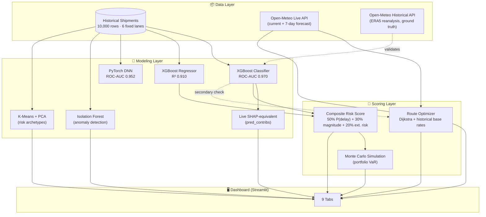

<div align="center">


<br/>

[](https://www.python.org/)
[](https://streamlit.io/)
[](https://xgboost.readthedocs.io/)
[](https://pytorch.org/)
[](https://open-meteo.com/)
[](#license)

**A leading-indicator ML + Deep Learning risk-scoring system for trade & supply-chain finance —**
**10,000 shipments, 31 global ports, two independently-trained models, live weather, and an AI-driven route optimizer.**

</div>

---

## 📖 Table of Contents

- [Why This Exists](#-why-this-exists)
- [The Finding That Shaped Everything](#-the-finding-that-shaped-everything)
- [What's Inside](#-whats-inside)
- [Architecture](#-architecture)
- [Model Performance](#-model-performance)
- [Quick Start](#-quick-start)
- [Repository Structure](#-repository-structure)
- [Honest Limitations](#-honest-limitations)
- [Tech Stack](#-tech-stack)
- [License](#license)

---

## 🎯 Why This Exists

Banks providing trade finance — letters of credit, invoice discounting, supply-chain finance — price and underwrite risk against a physical shipment actually arriving. Delay or disruption directly affects collateral value, buyer payment timing, and counterparty risk.

This project takes a raw shipment dataset and builds the kind of risk system a bank's model-risk team would actually sign off on: **leading indicators only** (no outcome leakage), **two independently-trained models cross-checking each other**, **honest reporting of what the data does and doesn't support**, and **live external data layered on top** of static historical patterns.

## 🔍 The Finding That Shaped Everything

Before building anything, the data was interrogated — and it pushed back.

<div align="center">

</div>

`Geopolitical_Risk_Index` and `Weather_Severity_Index` correlate with actual delay at **r ≈ 0.001–0.006** — essentially zero. What actually predicts delay is route, mode, cost, and category structure. Every model in this repo is built around that finding, not around the assumption that "risk index" columns must matter because they sound like they should.

<div align="center">

</div>

Explainability (computed live via XGBoost's native `pred_contribs` — mathematically identical to `shap.TreeExplainer`, zero extra dependency) confirms it: cost-per-kg and schedule structure dominate; the risk indices barely register.

<div align="center">

</div>

The resulting composite risk score calibrates cleanly against real outcomes — Low tier: 0.2% actual delay rate, Severe tier: 99.2%.

## 🧩 What's Inside

| Tab | What it does |
|---|---|
| 📊 **Portfolio Overview** | KPIs, Sankey flow (mode → route → outcome), treemap, delay-rate trend over time |
| 🌍 **Global Risk Map** | Trade lanes on a world map, colored by predicted risk, sized by volume |
| 🔍 **Risk Explorer** | Density heatmaps, violin plots, sortable high-risk shipment table with CSV export |
| 🎯 **Shipment Risk Scorer** | Score a hypothetical shipment — XGBoost + PyTorch DNN side by side, SHAP explanation, anomaly check, auto-generated underwriting memo |
| 🧠 **Model Explainability** | Live SHAP-equivalent feature importance and beeswarm plots |
| 🤖 **Advanced AI Lab** | Isolation Forest anomaly detection, K-Means + PCA risk archetypes, Monte Carlo portfolio exposure simulation |
| 🛰️ **Live Port Conditions** | Real marine weather (Open-Meteo) for 31 ports — batched requests, auto-refresh, graceful degradation |
| 📜 **Historical Validation** | Ties every shipment to *real* historical weather (not synthetic), tests whether it improves the model |
| 🧭 **Route Optimizer** | Dijkstra shortest-path + ML-driven edge weighting across the port network, 4 priority modes |

## 🏗️ Architecture



## 📈 Model Performance

| Model | Metric | Score |
|---|---|---|
| XGBoost Classifier | ROC-AUC | **0.970** |
| XGBoost Classifier | PR-AUC | 0.948 |
| XGBoost Regressor | R² | 0.910 |
| XGBoost Regressor | MAE | 0.33 days |
| PyTorch DNN (embeddings + MLP) | ROC-AUC | 0.952 |

Trees have a modest edge over the neural net here — reported honestly rather than picking whichever number looks better. Both models run live in the Scorer tab with an agreement indicator: large disagreement between them flags an input worth manual review (this genuinely caught an out-of-distribution edge case during development).

## 🚀 Quick Start

```bash
git clone <this-repo>
cd supply-chain-disruption-risk-engine
pip install -r requirements.txt
streamlit run app.py
```

Opens at `http://localhost:8501`. No API keys required — Open-Meteo (live + historical weather) is free and keyless.

## 📁 Repository Structure

```
├── app.py                    # Main Streamlit dashboard (9 tabs)
├── data_utils.py              # Feature engineering, scoring, SHAP, clustering, Monte Carlo
├── dl_model.py                 # PyTorch deep learning model (train + inference)
├── weather_api.py              # Live Open-Meteo integration (batched, retry-safe)
├── historical_weather.py       # Historical ground-truth weather validation
├── route_optimizer.py           # Dijkstra + ML-driven route optimizer
├── deep_risk_net.pt             # Trained PyTorch model weights
├── deep_risk_net_meta.json       # PyTorch model metadata (encoders, scaler)
├── delay_classifier.joblib        # Trained XGBoost classifier
├── delay_regressor.joblib          # Trained XGBoost regressor
├── global_supply_chain_disruption_v1.csv  # Source dataset
├── requirements.txt
└── assets/                          # README graphics
```

## ⚠️ Honest Limitations

- **Synthetic dataset** — the historical data contains exactly **6 fixed lanes** (no free combination of any origin with any destination). Every model here is built and validated around that constraint, not despite it.
- **Route Optimizer city pairs outside those 6 lanes are extrapolations.** Testing showed the classifier alone is unstable for novel city pairs (a single feature swap swung predicted probability from 0.86 to 0.0005 for the *same real lane*) — so the optimizer's primary risk signal is a robust historical base rate, with the classifier kept as a transparent, clearly-labeled secondary check, not the driver.
- **No time-series out-of-time validation yet** — validated on a random holdout, not genuinely future shipments.
- Live weather tabs need outbound internet access (works on Streamlit Cloud by default; blocked in some restricted sandboxes).

## 🛠️ Tech Stack

`Python` · `XGBoost` · `PyTorch` · `scikit-learn` · `NetworkX` · `Plotly` · `Streamlit` · `Open-Meteo API`

## License

MIT — built as a portfolio project for fintech/banking risk roles.

