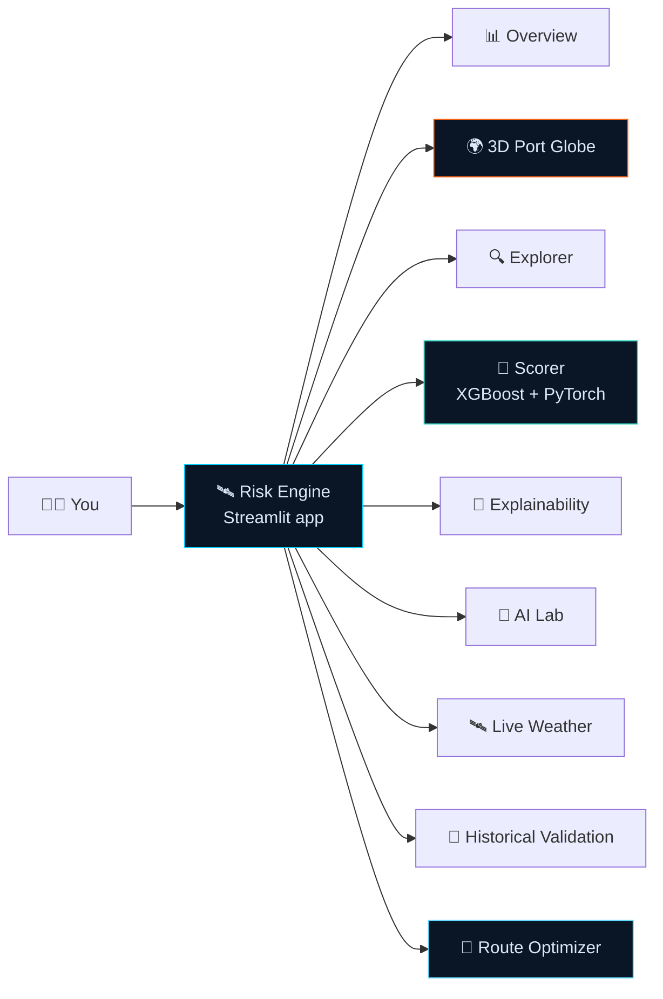
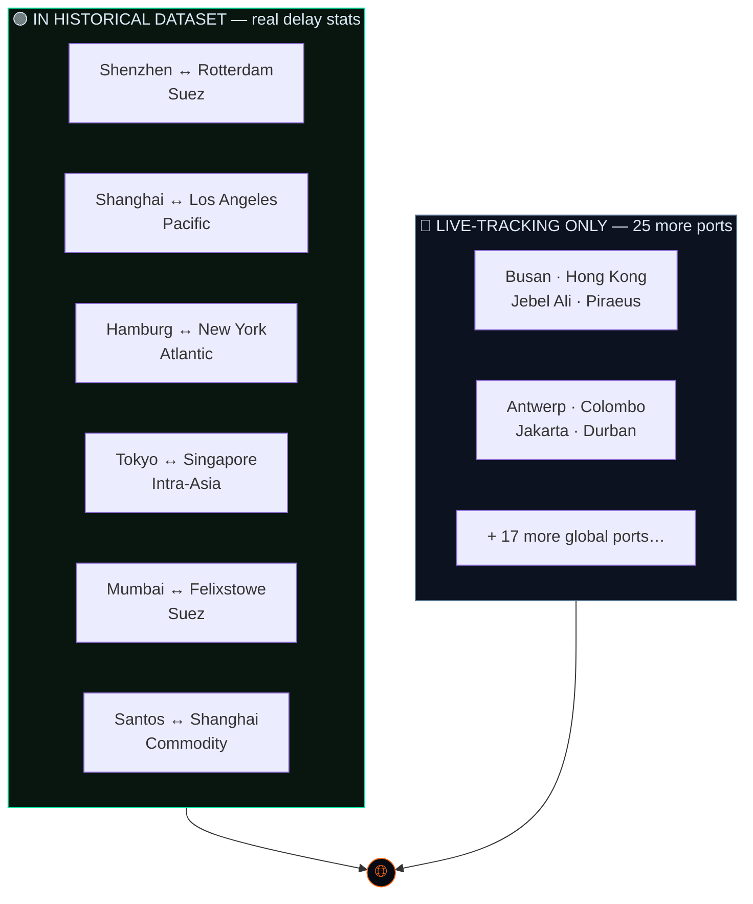

<div align="center">

# 🛰️ SUPPLY CHAIN DISRUPTION RISK ENGINE

**A leading-indicator ML + Deep Learning risk-scoring system for trade & supply-chain finance — two independently-trained models, live weather, a 3D port globe, and an AI-driven route optimizer, in one dashboard.**


</div>

---

## 🖥 What you're looking at



Before any model was built, the data was interrogated — and it pushed back. The dataset's own "risk indices" (geopolitical risk, weather severity) correlate with actual delay at **r ≈ 0.001–0.006** — essentially zero. What actually predicts delay is route, mode, cost, and product category structure. Every model in this dashboard is built around that finding, not around the assumption that risk-sounding columns must matter.

---

## 🌍 3D Port Globe

A real WebGL globe ([globe.gl](https://globe.gl/), Three.js) — not a flat map projection — covering **31 tracked ports**, with animated arcs for the 6 real historical trade lanes and click-to-inspect stats per port.



**Interactions:**
- 🖱 **Drag** to rotate, **scroll** to zoom, **hover** any port for a quick label
- 📌 **Click** a port to open its stats panel — real delay rate, risk score, and volume for the 6 dataset ports; region + coordinates for the other 25
- 🎛 Auto-rotate toggle, atmosphere glow, dashed animated arcs colored by lane risk tier

This runs entirely client-side — `globe.gl` is fetched by your browser, not the Streamlit server, so it has no dependency on the server's own network access.

---

## 📊 Feature Map

| Tab | Highlights | Stack |
|---|---|---|
| 📊 **Portfolio Overview** | KPIs, Sankey flow (mode → route → outcome), treemap, delay-rate trend over time | Streamlit + Plotly |
| 🌍 **3D Port Globe** | 31 clickable ports, animated risk-colored arcs for real lanes | globe.gl (WebGL) |
| 🔍 **Risk Explorer** | Density heatmaps, violin plots, sortable shipment table, CSV export | Streamlit + Plotly |
| 🎯 **Shipment Risk Scorer** | XGBoost + PyTorch side by side with an agreement check, live SHAP explanation, anomaly flag, auto-generated underwriting memo | XGBoost, PyTorch |
| 🧠 **Model Explainability** | Live feature importance via XGBoost's native `pred_contribs` (SHAP-equivalent, zero extra dependency) | XGBoost |
| 🤖 **Advanced AI Lab** | Isolation Forest anomaly detection, K-Means + PCA risk archetypes, Monte Carlo portfolio simulation | scikit-learn |
| 🛰 **Live Port Conditions** | Real marine weather for all 31 ports, batched requests, auto-refresh | Open-Meteo API |
| 📜 **Historical Validation** | Ties shipments to real historical weather, tests whether it improves the model | Open-Meteo Archive API |
| 🧭 **Route Optimizer** | Dijkstra shortest path + historical risk weighting, 4 priority modes, optional Google Maps last-mile leg | NetworkX, Google Routes API |

---

## 🚀 Quick Start

```bash
pip install -r requirements.txt
streamlit run app.py
```

Python 3.10+. Runs fully without any API keys — Open-Meteo (weather, current + historical) is free and keyless. Google Maps last-mile routing is optional and needs your own billing-enabled key (see [Configuration](#️-configuration-all-optional)).

---

## 📁 Repository Structure

```
.
├── app.py                              # Main dashboard — 9 tabs
├── data_utils.py                       # Feature engineering, scoring, SHAP, clustering, Monte Carlo
├── dl_model.py                         # PyTorch deep learning model (train + inference)
├── weather_api.py                      # Live weather (Open-Meteo, batched + retry-safe)
├── historical_weather.py               # Historical weather ground-truth validation
├── route_optimizer.py                  # Dijkstra + ML-driven route optimizer
├── google_maps_api.py                  # Last-mile delivery routing (optional)
├── globe_view.py                       # 3D WebGL globe (globe.gl)
├── delay_classifier.joblib             # Trained XGBoost classifier
├── delay_regressor.joblib              # Trained XGBoost regressor
├── deep_risk_net.pt / .json            # Trained PyTorch model + metadata
├── global_supply_chain_disruption_v1.csv  # Source dataset
├── requirements.txt
└── README.md
```

---

## ⚙️ Configuration (all optional)

Fully functional out of the box on free, keyless endpoints. One optional feature needs a key, entered directly in the Route Optimizer tab's "Last-mile delivery" section — not a secrets file:

| Feature | Unlocks | Without it |
|---|---|---|
| Google Maps API key (Routes API + Geocoding API, billing-enabled) | Real road-network last-mile delivery leg from arrival port to a final address | Route Optimizer still works fully for the ocean/air trunk route — last-mile section just stays unused |

---

## 🏗 Architecture Notes

```mermaid
flowchart LR
    A["Raw dataset<br/>29 columns"] --> B{"Outcome-adjacent?<br/>Disruption_Event,<br/>Actual_Lead_Time..."}
    B -->|"excluded"| C["Leakage — would produce<br/>an artificially perfect,<br/>useless model"]
    B -->|"kept"| D["Leading indicators only<br/>route, mode, cost, schedule,<br/>risk indices, season"]
    D --> E["XGBoost + PyTorch<br/>trained & compared"]

    style C stroke-dasharray: 5 5,color:#5a7a95
    style D fill:#08160f,stroke:#00e5a0
    style E fill:#0a1525,stroke:#00d4ff
```



- **No outcome leakage** — `Disruption_Event` alone is 91–100% deterministic of the delay label in this dataset, so it (and other outcome-adjacent fields) is excluded from every model, even though including it would inflate accuracy.
- **Two independent models, not one dressed up as two** — XGBoost (ROC-AUC 0.970) and a PyTorch DNN with learned categorical embeddings (ROC-AUC 0.952) are trained on the identical split and shown side by side in the Scorer tab with a disagreement flag.
- **Route Optimizer doesn't trust the classifier for novel city pairs** — the historical dataset has exactly **6 fixed lanes** (no free combination of any origin with any destination). Testing showed the classifier is unstable outside them (a single feature swap swung one prediction from 0.86 to 0.0005 for the same real lane), so the optimizer's primary risk signal is a robust historical base rate instead, with the classifier kept only as a transparent secondary check.
- **Live weather is batched, not per-port** — all 31 ports fetch in 2 HTTP requests total (one marine, one wind), not 22, avoiding the rate-limit wall a naive per-port implementation hits.
- **The globe is a client-side dependency** — `globe.gl` loads in the user's browser, independent of the Streamlit server's own network access.

---

## 🧰 Tech Stack

<div align="center">

| Layer | Technology | Used for |
|---|---|---|
| App framework |  | Tabs, sidebar, widgets, caching |
| Language |  | Modeling, fetchers, orchestration |
| Gradient boosting |  | Delay classifier + regressor, native SHAP-equivalent explainability |
| Deep learning |  | Categorical-embedding neural net, independent second model |
| Classical ML |  | Isolation Forest, K-Means, PCA |
| Graph algorithms |  | Dijkstra shortest-path route optimization |
| Charts |  | Every chart except the globe |
| 3D globe |  | 3D Port Globe, client-side rendered |
| Data |   | DataFrames, numeric ops |
| Networking |  | Open-Meteo, Google Maps |

</div>

### External data sources

<div align="center">

 

</div>

---

## 🧭 Known Limitations

- The historical dataset contains exactly **6 fixed lanes** — no free combination of any origin with any destination — so predictions for any other city pair are extrapolations, not interpolations. The Route Optimizer is built around this constraint explicitly (see [Architecture Notes](#-architecture-notes)).
- No time-series out-of-time validation yet — validated on a random holdout, not genuinely future shipments.
- Live weather and Google Maps features need outbound internet access from wherever the app is hosted.
- Google Maps Platform requires a billing-enabled account, unlike the free/keyless Open-Meteo integration elsewhere in this project.

---

## 📄 License

Released under the MIT License — free to use, modify, and distribute, including commercially, with attribution and no warranty.

<div align="center">

---

*Built with XGBoost · PyTorch · Streamlit · globe.gl · Open-Meteo*

</div>
